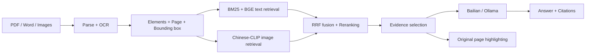

<p align="center"></p>

# Multimodal Document RAG

[](https://github.com/dongtingshuo/multimodal-document-rag/actions/workflows/ci.yml)
[](pyproject.toml)
[](docqa/api.py)
[](ui/app.py)

**[English](README.md) | [简体中文](README.zh-CN.md)**


Evidence-grounded question answering for Chinese documents. Search text, tables and figures, generate cited answers, and inspect the exact source region on the original page.

An end-to-end document intelligence system with local retrieval, configurable cloud or local generation, and a separate evaluation workflow.

## Capabilities

- **Document ingestion:** PDF, DOCX, legacy DOC and images; PyMuPDF rendering, optional Docling layout parsing and RapidOCR for scanned content. Legacy DOC requires LibreOffice.
- **Hybrid retrieval:** BM25, BGE embeddings, reciprocal rank fusion and cross-encoder reranking, with optional Chinese-CLIP visual retrieval.
- **Traceable evidence:** shared element schema, document/page provenance, normalized bounding boxes, page crops and source highlighting.
- **Multimodal answers:** Alibaba Cloud Bailian or local Ollama; select the provider and model in the UI, with evidence and citation checks shared across backends.
- **Application workflow:** FastAPI, Streamlit and SQLite; duplicate detection, document deletion, session scope, retries and request limits.
- **Evaluation tooling:** six controlled configurations, resumable runs, per-question records, blind-review export and scoring coverage.

## Quick start

Use Python 3.11 (the validated development version) on macOS or Linux. The launcher expects a project `.venv`; you may create it from an existing suitable Conda environment. Model downloads require network access and sufficient disk space. No cloud key is needed for retrieval.

```bash
git clone https://github.com/dongtingshuo/multimodal-document-rag.git
cd multimodal-document-rag
python3 -m venv .venv
.venv/bin/python -m pip install -e '.[layout,vision,test]'
cp .env.example .env
.venv/bin/python scripts/download_models.py --reranker
bash scripts/start.sh
```

Open the frontend URL printed by the launcher; defaults are `http://127.0.0.1:8501` (UI) and `http://127.0.0.1:8000/docs` (API documentation). Occupied ports are skipped automatically. To choose starting ports:

```bash
DOCQA_BACKEND_PORT=8100 DOCQA_FRONTEND_PORT=8510 bash scripts/start.sh
```

**Choose a generation backend in `.env`:**

| Backend | Configuration | Preparation |
| --- | --- | --- |
| Bailian | `DOCQA_GENERATION_PROVIDER=bailian`, `DOCQA_API_KEY=...` | Use a model and regional API endpoint available to your account; generation uses cloud quota. |
| Ollama | `DOCQA_GENERATION_PROVIDER=ollama` | Start Ollama and run `ollama pull qwen2.5vl:7b`; local inference requires sufficient RAM. |

The sample cloud model ID records the project's configuration; availability depends on your account. The UI can switch providers and models at runtime. Connectivity checks do not establish answer quality.

Upload a document, wait for parsing, select its scope, then search or ask a question. Follow the answer's citations to inspect original-page evidence.

## Configuration

See [.env.example](.env.example) for the complete sample and [the bilingual configuration guide](docs/CONFIGURATION.md) for deployment details.

| Variable | Default | Purpose |
| --- | --- | --- |
| `DOCQA_PARSER` | `docling` | Set `pymupdf` for the lighter parsing path. |
| `DOCQA_ENABLE_OCR` | `true` | OCR for scanned content. |
| `DOCQA_ENABLE_CLIP` | `false` | Enable Chinese-CLIP image retrieval; requires the vision extra and weights. |
| `DOCQA_DEVICE` | `cpu` | Inference device; CPU is the conservative default. |
| `DOCQA_LOCAL_MODELS_ONLY` | `false` | Require cached Hugging Face models when enabled. |
| `DOCQA_DATA_DIR` | `data` | Local documents, database, indices and outputs. |

**Visual retrieval and image input are separate controls.** CLIP changes which images are retrieved; `include_images` controls whether selected images are sent to the generation model. Enabling image input alone does not enable CLIP retrieval. Text and image embeddings use separate indices and are combined through ranking, not vector concatenation.

On macOS, build the optional desktop launcher with `zsh scripts/build_app.sh` (Xcode Command Line Tools required), then open `文档问答.app`. The generated App is excluded from Git; its source and icons are included.

## Architecture



The request path is `ui/app.py → docqa/api.py → docqa/service.py → retrieval.py / generation.py`. SQLite stores metadata; original files and rendered evidence live under the local data directory. FAISS queries run in a separate process to avoid the observed macOS OpenMP conflict.

## Evaluation and evidence

The archived baseline covers **20 public reports, 285 pages and 100 annotated questions**. The table below is the **historical frozen baseline**, evaluated on 67 answerable test questions; it is not a new measurement of this release.

| Method | Recall@1 | Recall@10 | MRR@10 |
| --- | ---: | ---: | ---: |
| BM25 | 0.119 | 0.493 | 0.205 |
| BGE dense | 0.060 | 0.343 | 0.124 |
| RRF hybrid | 0.194 | 0.582 | 0.336 |
| Hybrid + reranker | 0.388 | 0.657 | 0.490 |
| Hybrid + CLIP + reranker | 0.418 | 0.746 | 0.507 |

See [the baseline report (Chinese)](docs/EXPERIMENT_RESULTS.md) and [the bilingual evaluation guide](docs/EVALUATION_GUIDE.md). Nineteen reports share a monthly air-quality format, and all chart questions come from one CNNIC report. These results do not establish general document-QA accuracy. With generation disabled, groups D and E are identical retrieval controls; their scores cannot demonstrate a benefit from image input.

Source manifests and annotations are versioned in `datasets/`. Original PDFs, model weights and historical per-question runtime archives are not distributed here. Historical documents explicitly identify local-only references. Re-parsing requires rebuilding and checking element annotations.

## Development

```bash
.venv/bin/python -m pytest -q
.venv/bin/python -m ruff check .
bash scripts/start.sh --check
```

Tests exercise application behavior; parser, model and real-provider checks under `scripts/check_*.py` have additional runtime requirements. CI runs the test suite and lint with cloud credentials disabled; it does not benchmark model quality.

## Repository layout

```text
docqa/       Parsing, storage, retrieval, generation, evaluation and API
ui/          Streamlit application
scripts/     Launchers, model/corpus preparation and evaluation tools
tests/       Automated regression tests
datasets/    Public source manifest, questions and frozen model metadata
docs/        Setup, architecture, experiments and retrieval benchmarks
assets/      Desktop icon sources and App build template
.github/     Continuous integration and contribution templates
```

## Documentation

- [Configuration / 配置指南](docs/CONFIGURATION.md)
- [Evaluation / 评测指南](docs/EVALUATION_GUIDE.md)
- [User guide / 使用说明（中文）](docs/USER_GUIDE.md)
- [Script index / 脚本导航](scripts/README.md)
- [Project structure / 工程结构](docs/PROJECT_STRUCTURE.md)
- [Contributing / 贡献指南](CONTRIBUTING.md)
- [Security / 安全说明](SECURITY.md)
- [Third-party notices / 第三方说明](THIRD_PARTY_NOTICES.md)

## Scope

This application is designed for local document analysis. Agent planning, iterative retrieval and comprehensive semantic faithfulness verification are outside the implemented scope. Citation checks do not guarantee factual correctness. Cloud generation sends selected evidence to the configured provider. The application has no production authentication layer; keep its default loopback binding for local use.
