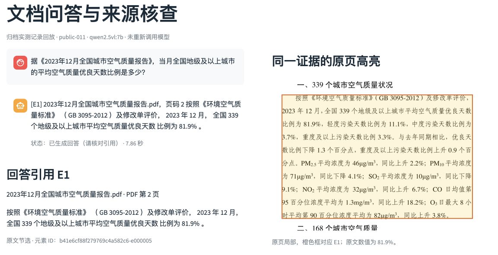
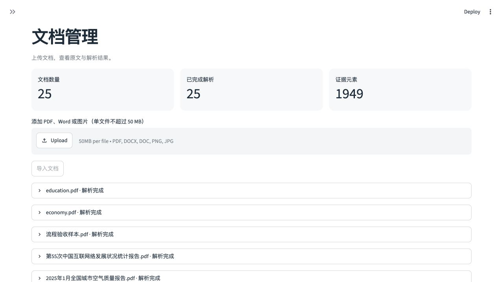
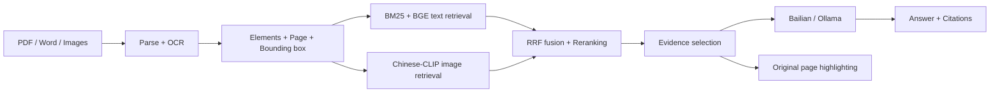

<p align="center"></p>

# Multimodal Document RAG

[](https://github.com/dongtingshuo/multimodal-document-rag/actions/workflows/ci.yml)
[](pyproject.toml)
[](docqa/api.py)
[](ui/app.py)

**[English](README.md) | [简体中文](README.zh-CN.md)**


**基于多模态检索增强生成的智能文档问答系统。** 面向中文文档，统一检索文本、表格和图像，生成带引用的回答，并在原始页面定位证据区域。

本项目提供完整的文档智能工程实现：本地检索、可配置的云端或本地生成、文档管理界面，以及独立的实验评测流程。

## 功能预览

### 回答、引用与原文证据



引用 **E1** 将回答与原始报告中的高亮区域关联，便于核对来源文字、数值和统计口径。

<details>
<summary><strong>文档管理</strong>：上传、解析状态与文档列表</summary>



文档工作区集中展示上传入口、解析状态与证据元素数量。图中数量来自示例工作区，与冻结评测语料规模不同。

</details>

## 核心能力

- **多格式解析：** 支持 PDF、DOCX、DOC 和图片；结合 PyMuPDF、可选 Docling 布局解析与 RapidOCR。旧版 DOC 转换需要 LibreOffice。
- **混合检索：** BM25、BGE 向量检索、RRF 排名融合、交叉编码器重排序，以及可选 Chinese-CLIP 图像召回。
- **证据追溯：** 统一元素结构，保留文档、页码和归一化边界框，支持原文高亮与区域裁剪。
- **多模态生成：** 支持百炼与 Ollama，可在界面切换后端和模型，复用相同的证据与引用校验。
- **应用工作流：** FastAPI + Streamlit + SQLite，支持重复上传检测、删除清理、会话范围、失败重试与调用上限。
- **实验工具：** 六组消融配置、断点续跑、逐题记录、盲评材料导出与评分覆盖率统计。

## 快速开始

使用 macOS 或 Linux，建议 Python 3.11（开发验证版本）。启动器默认使用项目 `.venv`；也可以先激活已有、适合本项目的 Conda 环境，再创建 `.venv`。首次下载模型需要网络与足够磁盘空间，纯检索无需云端密钥。

```bash
git clone https://github.com/dongtingshuo/multimodal-document-rag.git
cd multimodal-document-rag
python3 -m venv .venv
.venv/bin/python -m pip install -e '.[layout,vision,test]'
cp .env.example .env
.venv/bin/python scripts/download_models.py --reranker
bash scripts/start.sh
```

打开启动器输出的地址；默认前端为 `http://127.0.0.1:8501`，API 文档为 `http://127.0.0.1:8000/docs`。端口被占用时会自动递增。可指定起始端口：

```bash
DOCQA_BACKEND_PORT=8100 DOCQA_FRONTEND_PORT=8510 bash scripts/start.sh
```

**在 `.env` 中选择生成后端：**

| 后端 | 配置 | 准备工作 |
| --- | --- | --- |
| 百炼 | `DOCQA_GENERATION_PROVIDER=bailian`，填写 `DOCQA_API_KEY` | 使用账号可用的模型及地域端点；真实生成消耗云端额度。 |
| Ollama | `DOCQA_GENERATION_PROVIDER=ollama` | 启动 Ollama，执行 `ollama pull qwen2.5vl:7b`，确保内存足够。 |

示例云模型 ID 是项目使用的配置记录，实际可用性以账号为准。界面支持运行时切换后端与模型；连接检查不代表回答质量已验证。

上传文档并等待解析完成，选择文档范围后检索或提问，再点击回答引用核对原始页面。

## 配置与多模态控制

完整示例见 [.env.example](.env.example)，部署细节见[双语配置指南](docs/CONFIGURATION.md)。

| 变量 | 默认值 | 用途 |
| --- | --- | --- |
| `DOCQA_PARSER` | `docling` | 可设为 `pymupdf` 使用轻量解析路径。 |
| `DOCQA_ENABLE_OCR` | `true` | 启用扫描内容 OCR。 |
| `DOCQA_ENABLE_CLIP` | `false` | 启用视觉召回，需要 vision 依赖及权重。 |
| `DOCQA_DEVICE` | `cpu` | 推理设备，默认采用 CPU。 |
| `DOCQA_LOCAL_MODELS_ONLY` | `false` | 开启后要求 Hugging Face 模型已缓存。 |
| `DOCQA_DATA_DIR` | `data` | 原文件、数据库、索引与运行结果目录。 |

**视觉召回与图片输入是两个独立控制项。** CLIP 决定召回哪些图像；`include_images` 决定是否将选中的图像发给生成模型。只开启图片输入不会开启 CLIP。文本与图像向量分别建索引，通过排名融合，不拼接两类向量。

macOS 可执行 `zsh scripts/build_app.sh` 构建桌面入口，需要 Xcode Command Line Tools，然后打开 `文档问答.app`。仓库包含构建源码与图标，不提交本机生成的 App。

## 系统架构



主链路为 `ui/app.py → docqa/api.py → docqa/service.py → retrieval.py / generation.py`。SQLite 保存元数据，原件和渲染结果保存在本地数据目录。FAISS 查询在独立进程中执行，以规避已观察到的 macOS OpenMP 冲突。

## 实验与结果边界

公开语料包含 **20 份报告、285 页、100 道标注问题**。下表为**历史冻结版本的检索基线**，分母为测试集中 67 道可回答问题，不是本次发布重新测得的成绩。

| Method | Recall@1 | Recall@10 | MRR@10 |
| --- | ---: | ---: | ---: |
| BM25 | 0.119 | 0.493 | 0.205 |
| BGE dense | 0.060 | 0.343 | 0.124 |
| RRF hybrid | 0.194 | 0.582 | 0.336 |
| Hybrid + reranker | 0.388 | 0.657 | 0.490 |
| Hybrid + CLIP + reranker | 0.418 | 0.746 | 0.507 |

详见[基线报告](docs/EXPERIMENT_RESULTS.md)与[双语评测指南](docs/EVALUATION_GUIDE.md)。其中 19 份为空气质量月报，所有图表题来自同一份 CNNIC 报告，因此不能外推为通用问答准确率。关闭生成时，D/E 组是相同检索对照，不能据此证明图片输入提升回答质量。

仓库提供 `datasets/` 中的来源清单、题集与模型配置摘要；原始 PDF、模型权重及历史逐题运行归档不随源码分发。历史文档中仅在本机存在的材料已明确标注。重新解析后需要重建并核对元素标注。

## 开发与验证

```bash
.venv/bin/python -m pytest -q
.venv/bin/python -m ruff check .
bash scripts/start.sh --check
```

自动化测试用于应用行为回归。`scripts/check_*.py` 中的解析、模型与真实生成检查各有额外运行条件。CI 禁用云端凭据后运行测试与静态检查，不测量模型效果。

## 工程结构

```text
docqa/       解析、存储、检索、生成、评测和 API
ui/          Streamlit 界面
scripts/     启动器、模型与语料准备、实验工具
tests/       自动化回归测试
datasets/    公开来源、题集和冻结模型元数据
docs/        配置、架构、实验与检索基准
assets/      桌面图标源文件与 App 模板
.github/     持续集成和协作模板
```

## 文档导航

- [配置指南 / Configuration](docs/CONFIGURATION.md)
- [评测指南 / Evaluation](docs/EVALUATION_GUIDE.md)
- [使用说明](docs/USER_GUIDE.md) · [脚本导航](scripts/README.md)
- [工程结构](docs/PROJECT_STRUCTURE.md)
- [贡献指南](CONTRIBUTING.md) · [安全说明](SECURITY.md) · [第三方说明](THIRD_PARTY_NOTICES.md)

## 项目范围

本项目面向本地文档分析使用。Agent 任务规划、迭代检索和完整语义忠实度验证不在已实现范围内；引用检查不保证事实正确。云端生成会将所选证据发送给配置的服务商。应用尚未提供生产级身份认证，应保留默认本机监听。
